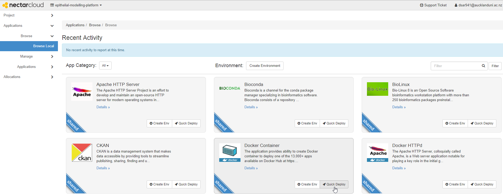
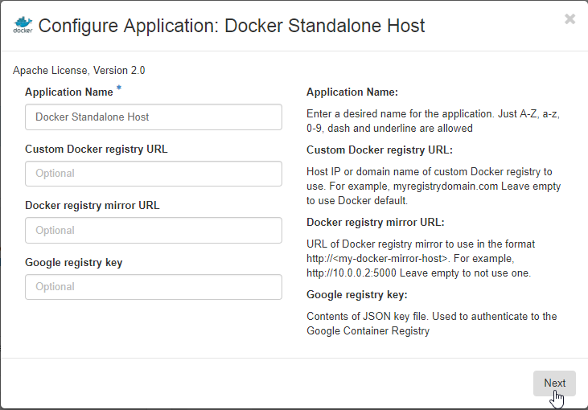
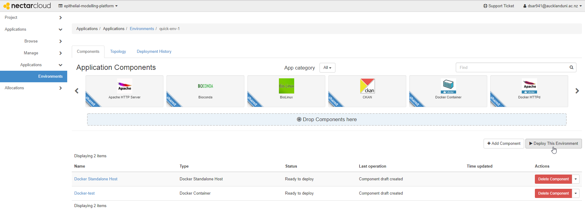
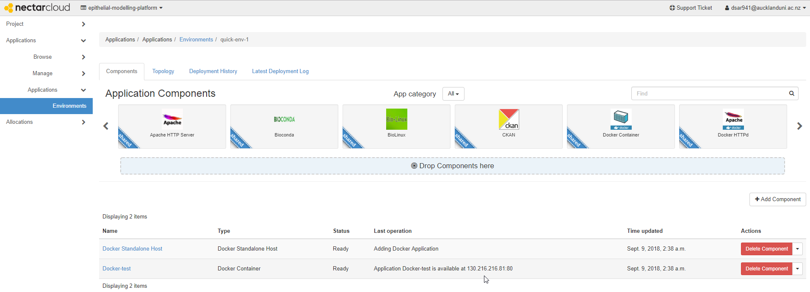

### Model Assembly Service (MAS)
Model Assembly Service is a web-based application to compose model entities in the model recipe and serialize a CellML model. This tool is deployed at this address: LINK TO ADDRESS HERE; as a demonstration of the capabilities described is the paper: LINK TO PREPRINT HERE?.

### Installing MAS
Need to update this paragraph: This tool makes use of webservices provided by [PMR](https://models.physiomeproject.org) as well as several services from the [European Bioinformatics Institute (EBI)](https://www.ebi.ac.uk/services). In oder to develop web applications which make use of services in this way, it is best to make use of a reverse proxy to ensure the web application plays nicely with modern web browsers. In this project, we use a Docker-based [NGINX](http://nginx.org/) reverse proxy for this purpose, which makes it reasonably easy to get this demonstration up and running locally as well as deploying it on various cloud platforms.

If you have Docker and git installed on your machine, then the following should get you up and running:
```
git clone https://github.com/dewancse/model-assembly-service.git
...
...
```
And then http://localhost:... should work.

### MAS workflow

#### First workflow

#### Second workflow

#### Third workflow

## Docker Image in Nectar Cloud
We have deployed our Docker image to Nectar Cloud. In order to begin with the deployment process, please navigate to [Dashboard](https://dashboard.rc.nectar.org.au/auth/login/) in Nectar Cloud and provide login credentials. As a student at the University of Auckland, I have provided my login credentials, as illustrated below. Following screenshots are examples of our Docker image's deployment to Nectar. Please read texts below of each screenshot to know in details.  

 

*A login screen, where the user will choose either NZ or Australian.*


*A screenshot illustrating my federation and organization details.*



*An example Docker setup session, where the user will click "Quick Deploy" to begin with a session.*


*Fill out an application name, a docker image name from the Docker registry, and a port number for the docker container. Then click "Add Application".*



*Enter an application name and the remaining fields are optional. Then click "Next".*


*Choose the Ubuntu instance name from the dropdown menu, along with your key pair and availability zone. Follow this [key pair](https://support.ehelp.edu.au/support/solutions/articles/6000055376-launching-virtual-machines#Keypair) document to create a key pair, which will appear here under the key pair dropdown menu. Then click "Create".*


*Click "Create" to setup an environment for the Docker container.*



*Then click "Deploy This Environment" to begin with a deployment session.*



*Lastly, navigate to the IP address with the port number mentioned in the screenshot to visit the up and running docker image. Note that the user can apply for a DNS host name for this IP address to Nectar support team [Ask For Help](https://support.ehelp.edu.au/support/home).*

### Accessibility
The application is accessible by navigating::
```
  LINK TO ADDRESS HERE
```

### Programming Language
- Python 3.7

### Limitations
We will implement Unit testing and Functional testing to make sure the code is functioning as expected. While the underlying tools are not specific to renal epithelial transport, the currently supported text-to-query mappings and recommender system are very specific to renal epithelial transport.
### List of contributors
- Dewan Sarwar - @dewancse
- David Nickerson - @nickerso

### Licencing
MIT license!

### Acknowledgements
This project is supported by the MedTech Centre of Research Excellence (MedTech CoRE), the Aotearoa Foundation, and the Auckland Bioengineering Institute.